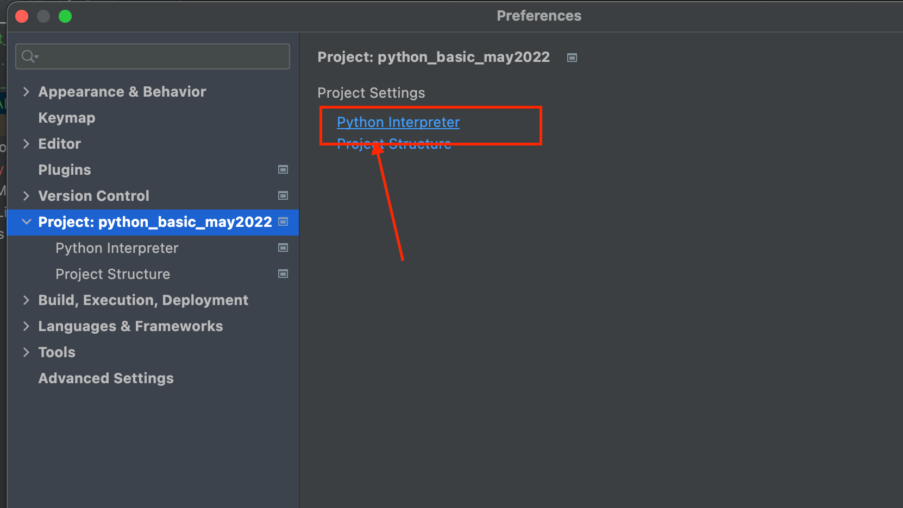
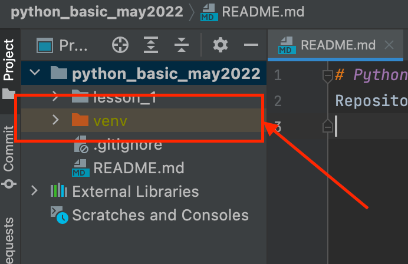
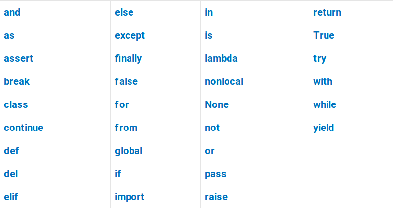

# Hi there!

This is a first lesson short description and how to install the stuff and be prepared

##  Python installation

Download [here](https://www.python.org/downloads/)

Install on linux: 
+ Open terminal and run command `sudo apt install python3.10` (it will ask an admin password)
+ check python  with command `python -V` ( it will return like >> Python 3.10.4)

## Install PyCharm
Download [here](https://www.jetbrains.com/pycharm/download/)

Choose Community edition,  it is quite enough, while Professional is only 30days trial and payable after

NOTE: Installing on Windows DO NOT FORGET a checkbox "Add Python to PATH"

WIndows 10 installation:

## Set the Python interpreter in your Project to run python and use python console
Go to PycHarm settings , select Project tab, press Python interpreter:

 Create new if not exists.

Then you will have a new folder `venv` with all python interpreter files according to your project:

## Check the first_lesson.py

Run it locally from your IDE or from terminal.

Additional notes about Python naming conventions.
Usage of reserved words is forbidden and will cause a syntax error.

> `import = 33` >>> `SyntaxError: invalid syntax`

Reserved words are:

Usage of built-in functions as variable names is not forbidden but HIGHLY not recommended.
It will not cause an error, but is a bad practice. You don`t want to be a bad programmer.

> `sum = 10` >>> Absolutely ok syntax, no error, but now you can't use built-in function sum().

> `len = 'some'` >>> Absolutely ok syntax, no error, but now you can't use built-in function len()

## Good books to read:

1. Марк Лутц - Изучаем Python  (5 издание, том 1,2)
2. Марк Лутц - Программирование на Python 4-е издание Том 1, 2
3. Марк Саммерфилд - Программирование на Python 3. Подробное руководство
