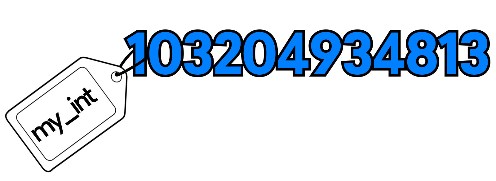
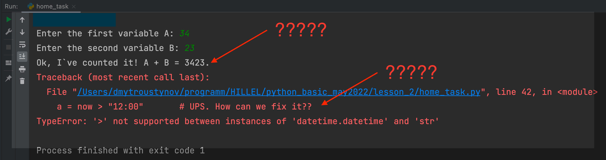

# Hi there again! Welcome to our second lesson

Just few links that we discussed:

* Good to know and apply - [Zen of Python](http://ruslan.rv.ua/python-starter/zen.html).
* Guide to write readable code - [PEP8](https://peps.python.org/pep-0008/).
* Python Standard library - [docs and more](https://docs.python.org/3/library/).
* How to convert datetime to strings like a boss - [link](https://www.journaldev.com/23365/python-string-to-datetime-strptime).

## Variables and how to better understand them

When we create smth like `total_length = len(l1) + len(l2)`, we have several operations under the hood:
1. Count and perform all calculations to the right of the `=` sign, in this case count the sum of the length of two lists.
2. Create variable with name `total_length` (if not created)
3. Link the variable `total_length` to the object that we created with calculations on step 1.

Variable is not a box that contains something.

Variable is a link (label) to some box (object) with some value inside.

And we may have two variables that link to one object...

## Mutable and immutable
... and when we change mutable object, than it may look like we changed one variable changing another.

But no. We changed the mutable object. So all variables that were linked to it will return it's new value.

Try to deal with that in our `home_task.py`

## Home task
### part 1
- copy the file `home_task.py`
- do not run it at once. Try to figure out what it does. Read comments
- try to count yourself, what the values will return all variables
- create new lines with `print(a)`, `print(b)`, `print(c)` to check were you right or not

### part 2

- Go to the second part with inputs and run the file. You have to enter some values when it asks
- Check, if it works correct or not (spoiler : no)
- Why does it work this way?? 
- Fix to make it work properly: 34 + 23 must be 57, not '3423', numbers should be added as numbers

### part 3
- WOW, it produces an error (see the picture).
- We need to fix smth, so it will work without any errors.

**The main task of part 3 - is to print if this time before 12:00 (morning) or after it (day, evening).**

Another saying is it AM or PM.

Do not forget to change the name of variable  - decide yourself which name is good here. 

'a' is not good. 

't' is also not good enough, even though it's about **T**ime

**Hint**: Do you remember how to convert datetime? We discussed it on the lesson and even in this Readme you can find something...

**Hint 2**: try to inspect datetime object in python console. May be you find something yourself...

**Hint 3**: Ask your teacher.

- As a result of home task make screenshots with lines you changed and how it works