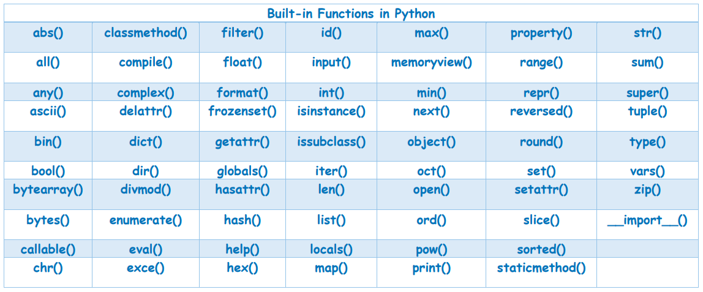

# HI THERE!

This is a common Readme for the several last lessons we've completed.

Contains just few notes to recall.

## Something about iterable

Strings are iterable.

Ranges are iterable.

Collections (like, list, set, tuple) are iterable.

Dictionaries are iterable.

Numbers are not iterable, they are just numbers.

1. Any iterable can be used in creating `for` loops:

```python
for element in some_iterable:
    do_something()
```
On every step (iteration) the variable `element` will be equal to a single element of the `some_iterable` object, starting from 0 to the end.

2. Any iterable also can be used in operations to check if an iterable contains something:
```python
255 in range(255)
'hello' in 'hello world!'
'a' in ['1', '2', 'A', 'B']
```
The result of `in` operation is boolean, so we can use this for building any conditional structures.

3. And of course  we can use any iterable in list/set/dictionary comprehensions:
```python
# create reverse dict in a single line
reverse_dict = {v:k for k, v in some_dict.items()}
```
Check more examples for list comprehensions in lesson 3 [Readme](https://github.com/ustyn/python_basic_may2022/tree/main/lesson_3).

4. You may find very useful function to deal with iterables: `enumerate()`. Explanation read [here](https://realpython.com/python-enumerate/).


## About functions in Python

You may want to read about functions in python [here](https://www.w3schools.com/python/python_functions.asp).

Python also has plenty of built-in functions, that you can use without any imports:



We have already utilized some of them like `print`, `int`, `str`, `dict`, `list`, `len`, `range` etc.

Yeeaah, `str()` or `list()`, or `int()` are also functions that create and return an instances of corresponding _class_.

Dont worry if any other built-in function looks strange or unclear for you right now, we will learn more at the next steps.

About built-in functions you may want to read [here](https://www.toppr.com/guides/python-guide/references/methods-and-functions/python-built-functions/).


## Home task
You have the scratch file `morse.py`, download it and rename to
`morse_<your_last_name>.py`

You need to create an implementation for two functions :
* `encode_morse()`
* `decode_morse()`

As it mentioned in documentation for the functions - one for encoding sequence into morse code, and the other is for decoding  morse sequence to a human readable text.

The specification of the functions is described in details in theier docstrings.

Also, you can add a morse encoded message for your teacher in your file. 

I'll try to decode it myself ))

Attach your ready and working file to your home task in our LMS.

- -5 points for not working file, or with errors in file
- -5 points for a file with incorrect name or format

### Hint:
    you may need to create reversed morse dictionary to convert letters to morse dashes-and-dots