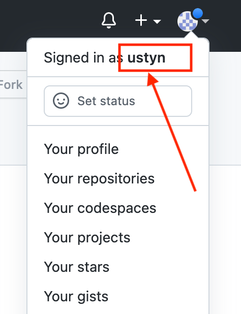
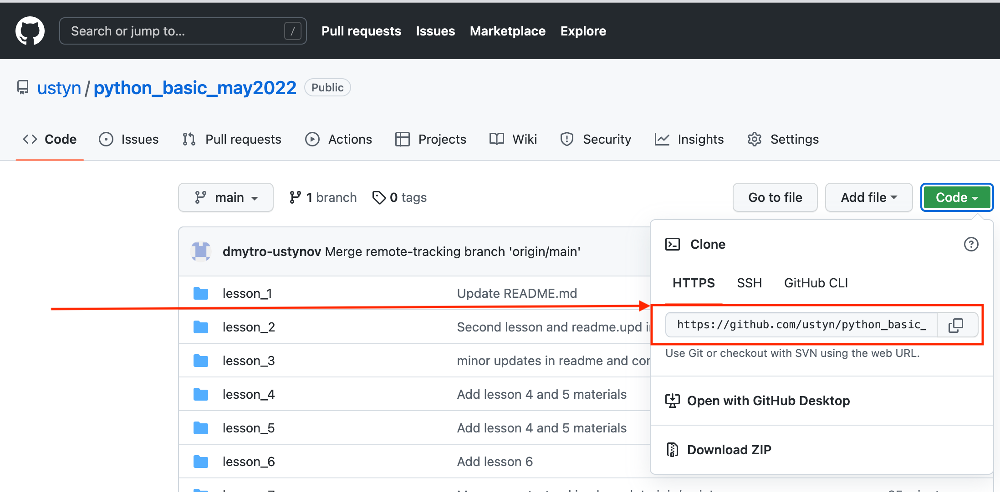
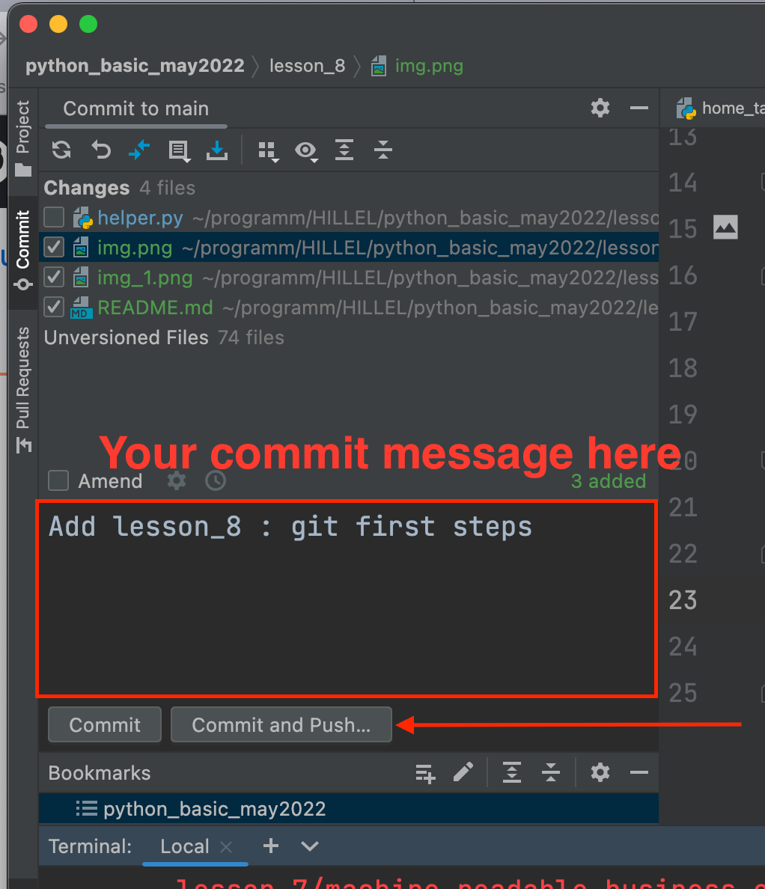

# TIME TO GIT!

ok guys, 8 lessons behind we've got a lot of materials and some staff to share.

Let's do it with git

1. Install git to your local machine if not installed yet
`sudo apt get install git`
2. Create git account https://github.com/login
3. Share with me your github name. You can check it in top right corner when you are logged in:



5. Clone this project to your machine. We will work from this repo and you will share your home tasks here

`git clone https://github.com/ustyn/python_basic_may2022.git`

this command will create a sub folder `python_basic_may2022` in the folder where you run this command.

6. Add some changes - create `hello_world_<your_last_name>.py` file in the `lesson_8` folder with some python content. Whatever, it doesn't matter much right now, it may be just
```python
print('Hello world, this is Vasya! And this is my first commit to git')
```
7. Commit your changes and push.


## That's it you are done!


## Watch good videos about git
https://youtu.be/QjT4HuF9gJs

[https://youtu.be/au1Tb0tEe6I](https://youtube.com/playlist?list=PLlWXhlUMyooYE1nvMUMdorkFVvUgWClUY)
